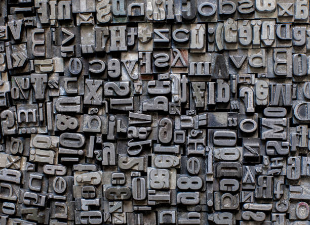

### Prensa is a Design System developed by xproglabs.
### Build your website using Blocks!

<br/>

## Getting Started

### Compatibility
- NodeJS projects
- React library
- Styled-components

### Installing prensa

1. Install prensa as a dependecy of your project
```shell
npm install @xprog/prensa
```

2. Create a new theme
```jsx
// src/styles/theme.ts

import CreateTheme from '@xprog/prensa/styles/theme'

export const theme = CreateTheme({
  colors: { orange500: '...', colorTest: '...' },
  fonts: { primary: '...', secondary: '...' }
})
```

3. Configure your design-tokens language in global declaration file
```ts
// prensa_tokens.d.ts

export type ColorTokens = 'orange500' | 'colorTest' 
export type FontTokens = 'primary' | 'secondary'
```

4. Components ready to use!
```jsx
import Block from '@xprog/prensa/components/Block'

<Block color='orange500'></Block>
```

## Components List
- AccordionEditorial
- AdBlock
- Article
- AuthorBio
- AuthorProfile
- Block
- Button
- Carousel
- Copyright
- Dialog
- EditArea
- ErrorPage
- Field
- Form
- Grids
- Icon
- Image
- ImageGallery
- Link
- Notice
- PageBlock
- PageTitle
- Pagination
- PreviewProvider
- RenderSlot
- SectionTitle
- SideMenu
- SocialMedias
- Subject
- Teaser
- Templates
- Typography

## Contributing

## Abstract



> Prensa is inspired in Johannes Gutenberg printing press that was released in the year 1440 and started a revolution at the time. A person could print up to 3.600 pages per workday composing a page with the small letter blocks with ink. The printer applies pressure to the blocks that transfer ink to paper. This revolution introduces a Mass Comunication era where population could exchange more information faster.