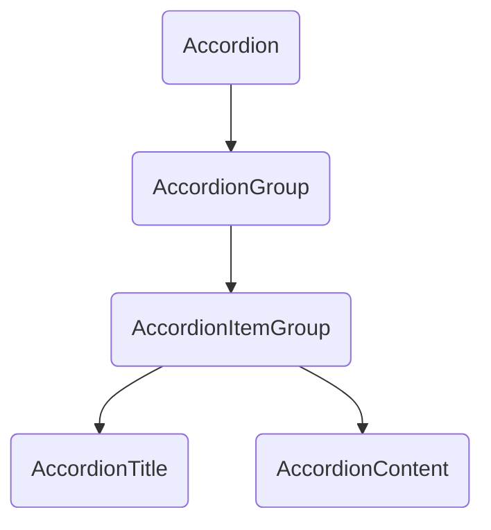
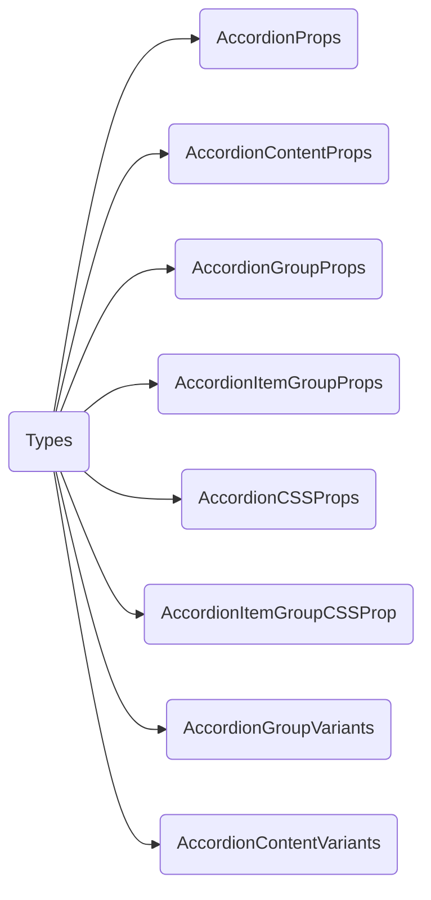

# Prensa Accordion

### Blocks map

```mermaid
flowchart TD
  A(Accordion) --> B(AccordionGroup)
  B --> C(AccordionItemGroup)
  C --> E(AccordionTitle)
  C --> D(AccordionContent)
```

### Types map

```mermaid
flowchart LR
  X(Types) --> 1(AccordionProps)
  X --> 2(AccordionContentProps)
  X --> 3(AccordionGroupProps)
  X --> 4(AccordionItemGroupProps)
  X --> 5(AccordionCSSProps)
  X --> 6(AccordionItemGroupCSSProp)
  X --> 7(AccordionGroupVariants)
  X --> 8(AccordionContentVariants)
```