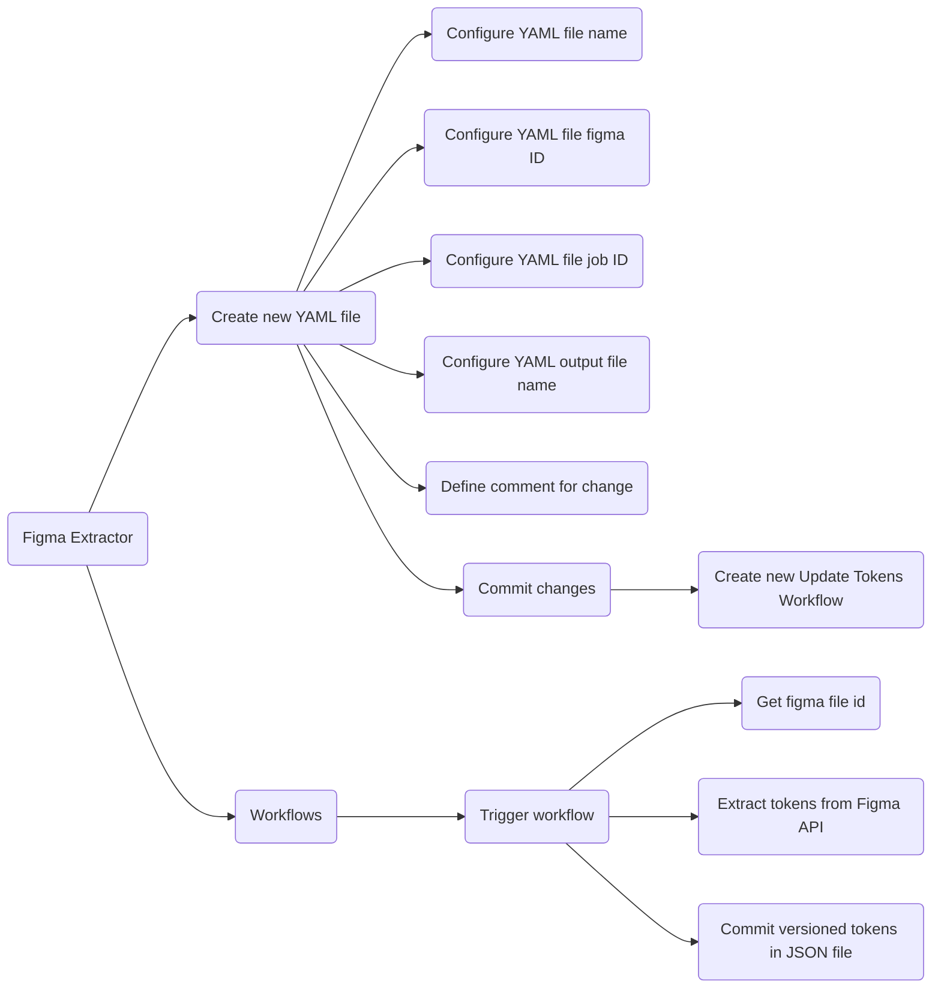
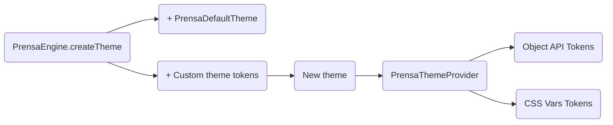

# Prensa Theme Management

Figma extractor URL: https://github.com/xproglabs/prensa-figma-extractor

<br/>

Prensa Tokens URL: https://github.com/xproglabs/prensa-design-tokens

## Theme consume

### 1. Install Prensa Tokens repository
```bash
  npm install https://github.com/xproglabs/prensa-design-tokens
```

### 2. Create new theme using a token cartridge
```jsx
  import { PrensaEngine, PrensaThemeProvider } from '@xprog/prensa'
  import ContosoTokens from '@xprog/prensa-design-tokens/3-themes/contoso.json'

  export const ContosoTheme = PrensaEngine.createTheme('contoso', {
    ...ContosoTokens
  })
```

### 3. Use created theme with PrensaThemeProvider
```jsx
  import { PrensaThemeProvider } from '@xprog/prensa'
  import { ContosoTheme } from '@themes'

  export const App = () => {
    return (
      <PrensaThemeProvider theme={ContosoTheme}>
        {children}
      </PrensaThemeProvider>
    )
  }
```

### 4. Use tokens to stylize your components!
```jsx
  import { ContosoTheme } from '@themes'

  export const FirstWay = () => (
    <Block
      css={{ backgroundColor: '$primaryColor' }}
    />
  )

  export const FirstWayComposed = () => (
    <Block
      css={{ backgroundColor: '$colors$primaryColor' }}
    />
  )
    
  export const SecondWay = () => (
    <Block
      css={{ backgroundColor: ContosoTheme.colors.primaryColor }}
    />
  )
```

## Tokens update flow



## Theme Creation flow



<!-- ### 1. Create ThemeProvider and useTheme hook using root components

```JSX
  import { PrensaEngine, PrensaThemeProviderRoot, useThemeRoot } from '@xprog/prensa'
  import ContosoTokens from '@xprog/prensa-design-tokens/3-themes/contoso.json'
  import AdvWorksTokens from '@xprog/prensa-design-tokens/3-themes/advworks.json'

  const ContosoTheme = PrensaEngine.createTheme('contoso', { ...ContosoTokens })
  const AdvWorksTheme = PrensaEngine.createTheme('advworks', { ... AdvWorksTokens })

  export const ThemeProvider = PrensaThemeProviderRoot([ ContosoTheme, AdvWorksTheme ])
  export const useTheme = useThemeRoot([ ContosoTheme, AdvWorksTheme ])
```

### 2. Define ThemeProvider in an HOC component

```JSX
  import { ThemeProvider } from '@theme'

  const App = ({ children }) => {
    return (
      <ThemeProvider theme='contoso | advworks'>
        {children}
      </ThemeProvider>
    )
  }
```

### 3. Use Object API props or useTheme hook to stylize using tokens

```JSX
  import { useTheme } from '@theme'

  const Component = () => {
    const { colors } = useTheme('contoso')
    return <Block css={{ backgroundColor: colors.primaryColor }}>
  }

  const Component = () => {
    const { colors } = useTheme()
    return <Block css={{ backgroundColor: colors.primaryColor }}>
  }

  const ComponentWithObjectAPI = ({ theme }) => {
    return <Block css={{ backgroundColor: theme.colors.primaryColor }}>
  }
``` -->